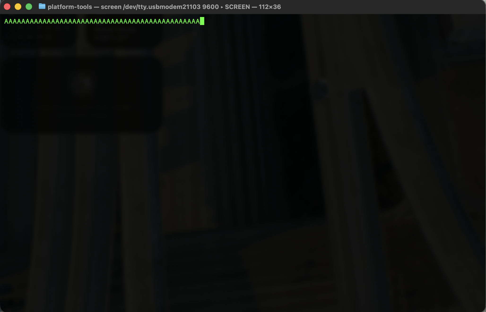

# IEEE Assignment 2

Repository for an IEEE student project using the STM32F446RE board

## 1. Objective

The goal of this assignment is to understand and implement **Universal Asynchronous Receiver-Transmitter (UART)** serial communication at the register level. This implementation establishes a connection between the **STM32F446RE** microcontroller and my MacBook to transmit data without using high-level libraries.

---

## 2. UART Protocol

- **What is UART?** It is a hardware communication protocol that uses asynchronous serial communication with configurable speed.
- **Frame Format:** This project uses the **8N1** configuration:
  - **1 Start Bit:** Signals the beginning of a data word (always 0).
  - **8 Data Bits:** The actual character/byte being sent.
  - **No Parity:** No error-checking bit is used for simplicity.
  - **1 Stop Bit:** Signals the end of the data word (always 1).
- **Baud Rate:** Set to **9600 bps**. This is the speed at which data is transmitted.
- **Asynchronous Concept:** There is no shared clock signal. Instead, both devices are set to a Baud Rate beforehand to sample data at the correct intervals.

---

## 3. Implementation

### Hardware Configuration (Registers)

- **RCC->AHB1ENR & APB1ENR:** Enabled clocks for GPIOA (Port A) and USART2.
- **GPIOA->MODER:** Configured Pin **PA2** to **Alternate Function Mode (10)**.
- **GPIOA->AFRL:** Mapped Pin PA2 to **AF7** (Internal connection to USART2_TX).
- **USART2->BRR:** Set the Baud Rate Register to `0x0683`.
- **USART2->CR1:** Enabled the USART peripheral (**UE**) and the Transmitter (**TE**).

### Baud Rate Calculation

For an internal clock ($f_{clk}$) of **16 MHz** and a target of **9600 Baud**:
$$BRR = \frac{16,000,000}{16 \times 9600} = 104.1875$$

- **Mantissa:** $104 = 0x68$
- **Fraction:** $0.1875 \times 16 = 3 = 0x3$
- **Final BRR Value:** `0x0683`

---

## 4. Output

The following screenshot shows the serial output in the terminal. The microcontroller is successfully transmitting the character 'A' every 1 second (triggered by Timer 2).

---

## 5. How to Run (only works on Mac idk about Windows or Linux)

1. Connect the STM32F446RE to your Mac via USB.
2. Flash the code using STM32CubeIDE.
3. Open Terminal and identify the port: `ls /dev/tty.usb*`.
4. Connect using: `screen /dev/tty.usbmodemXXXX 9600`.
